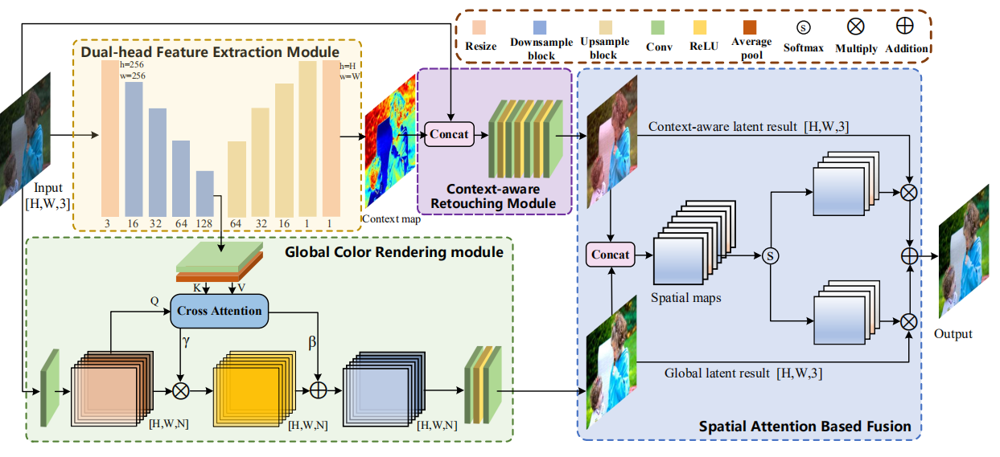
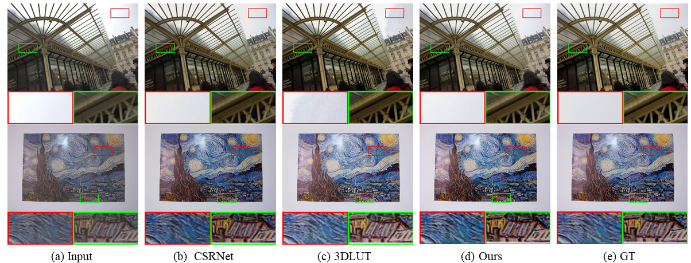

# Core codes for [DUAL-HEAD FUSION NETWORK FOR IMAGE ENHANCEMENT](https://ieeexplore.ieee.org/abstract/document/10096665)

 

## Overview

Framework of our proposed method which consists of 
- a dual-head feature extraction module
- a global color rendering module
- a context-aware retouching module
- a spatial attention based fusion

All modules are jointly learned from the annotated data in an end-to-end manner.

## Preparation
### Environment
    pip install -r requirements.txt

### Data
- [MIT-Adobe FiveK Dataset](https://data.csail.mit.edu/graphics/fivek/)
    - We use the setting of [Image-Adaptive-3DLUT](https://github.com/HuiZeng/Image-Adaptive-3DLUT) in our experiments, please refer to their page for details and data link.
- [PPR10K](https://github.com/csjliang/PPR10K)

Prepare the dataset in the following format and you could use the provided [FiveK Dataset class](/datasets.py).

    - <data_root>
        - input_train
        - input_test
        - target_train
        - target_test

Or you need to implement your own Class for your customed data format / directory arrangement.

## Training
The default settings of the most hyper-parameters are written in the [parameter.py](parameter.py) file.
To get started as soon as possible (with the FiveK dataset), only the 'data_root' needs to be modified before training.

    python train.py --data_root <path>

By default, the images, models, and logs generated during training are saved in [save_root/dataset/name](/FiveK/).
## Evaluation

To evaluate your own trained model of a specific epoch, specify the epoch and keep the other parameters the same as training.

For example,
    
    python evaluate.py --model *** --epoch 397

## Visualization & Analysis
- Compared with other methods 

    

- For video
<video src="video/video_compare.mp4" controls="controls" ></video>
[./video](/video)

